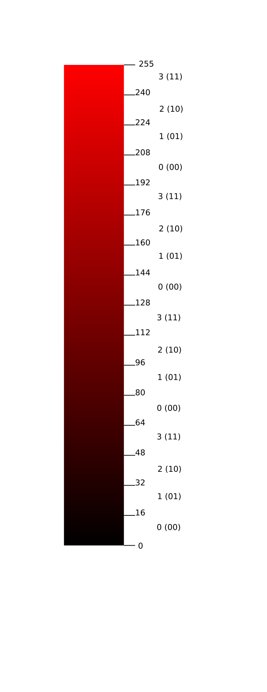
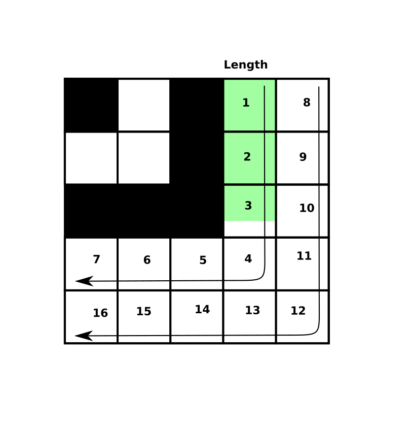

# How does this work?

## Encoding the song into binary data

Encoding a song works in a few stages.  First, the song has a serialization
format (thanks to [serde](https://serde.rs/)), which is what it uses to read and
write [TOML](https://github.com/toml-lang/toml) (its canonical text format) and
[bincode](https://github.com/servo/bincode) (its canonical binary format).  The
song can therefore be read from a TOML file, then converted to a binary bincode
format.

Then it is compressed as a [gzip](https://en.wikipedia.org/wiki/Gzip) payload,
this payload is baked into an image of the following format.

## The image format

The image format uses concepts similar to
[steganography](https://en.wikipedia.org/wiki/Steganography), where data is
hidden in other data (often, binary data is hidden in the image data of a
picture), but this is intentionally subverted to make it extremely clear that
there is data in the image.

For an example of steganography, a loaded image is usually expressed as
dimensions (x and y in pixels) and a series of pixels, where each pixel is
composed of red, green, blue, and alpha (transparency) values.  Each of these
numbers is a byte, or 8 bits, meaning that they can be any number from 0 to 255
(00 to FF in hex, if you're familiar with hex notation).  Each pixel has 32
bits, or 4 bytes, then.  If you clobber the last two bits of each channel, you
will change each color by at most 4 numbers (the difference between 124 and 128,
for instance), and you won't easily be able to see the result in the picture,
because the colors are only changed slightly.  You could hide a full byte of
data in every pixel of an image.  This has downsides.  The image will end up
larger than the data you put into it, potentially by a large amount, and any
amount of jpeg compression will destroy your data.  All the data will also be in
the top pixels of the picture.

I wanted to bake data into an image, but with different requirements:

* The image should very clearly be data-laden.  There should be no question
  about it.
* The data should fill the entire image if at all possible, to make it more
  visually interesting.
* The data should not be destroyed by jpeg compression or even minor
  rescaling and thumbnailing, and therefore can not use the alpha channel at
  all, as transparency might even be lost.

What I do here is encode 6 bits in each pixel, by using 2 bits from each color
channel.  I chose bits 4 and 5, meaning that for each value, there are 4
contiguous ranges of values it can be in while still having the data, as shown
in the following image (the left numbers show the decimal value of the color,
the right numbers show the decimal value of the contained data, and then the
binary value in parentheses):

When I change a pixel to contain data, I change it to the middle of the nearest
range with the value I want.  This allows the color to change enough to be clear
that it has been modified, but little-enough to still be recognizable roughly as
the color it was.  Moving to the middle of the range means that changes in color
from jpeg compression has to be more extreme to destroy the contained data, so
things being uploaded to compressing image hosts like Twitter won't destroy the
data.

Because there are only 6 bits per pixel, when I am encoding bytes into the
image, I have to interleave them so that every 4 pixels contains 3 bytes of data
(very similarly to how [base64](https://en.wikipedia.org/wiki/Base64) works, but
with bits of color channels instead of a 64-character set; you could easily map
each pixel to a base64 character to express the same exact data).

So the data to encode into the image is first prefixed with a 16-bit length
(meaning this has a hard limit of 64KiB), and then converted into the pixel
value data, the target is inserted at the beginning (this target is used in
decoding to figure out how big each superpixel is), and then we do a simple
square root to see the size of the grid we need.  The grid is checked against
the destination image dimensions to see how big each superpixel needs to be, and
then each superpixel region is processed, with the target simply rendered on the
top-left corner, and each image pixel being modified to contain the value of the
superpixel.  Because very few images will be an exact square number, the rest of
the superpixels are filled with unimportant values so that the color effect will
fill the entire image.

You might think that it would be enough to just lay the pixels out left-to-right
and top-to-bottom, but that doesn't actually work, because if you have a
data-grid of 37 and you are baking it into a 100x100 image, it will determine
that you need 2-pixel by 2-pixel superpixels, and bake them.  When you decode
the image, though, it will find that superpixels are 2 pixels big, and think
that you have a 50x50 superpixel grid, and you will read a bunch of garbage
interleaved into your grid.  We could solve this with a length at the beginning
of the data, but that's wasteful.  Given that the data is already
length-prefixed and will already be trailed with garbage data, we can instead
rearrange the reading order to allow all the garbage data, but just ensure it's
at the end.  We can do this by reading the image in a spiral order from the
target, like so:

The transparent green represents the length prefix of the binary data (as the
length prefix is 16 bits, and each pixel is 6 bits, the length prefix takes up 2
+ 2/3 of the superpixels).  This conveniently makes it not matter how big the
  decoder thinks the grid is, as long as it never underestimates.

## Decoding the image

The decoder works by scanning from the top left to find the target pattern and
figure out how wide and tall each superpixel is.  Then it iterates each
superpixel in order, scans each pixel inside, and selects the value that most
pixels in the superpixel seem to represent (compression and such can affect some
of the values, so as long as most are correct, it should be fine).  Then that
payload is decoded out using the length prefix, the data is decompressed, and
then used as bincode binary data to decode a Song out of it.

# Playing the song

The song is generated as
[PCM](https://en.wikipedia.org/wiki/Pulse-code_modulation).  Simply put, each
note has its frequency determined, and a ramp is set up to go from 0 to 1 that
many times a second.  The instrument selected uses that ramp to generate sound
waves, which your browser then turns into audio output.
